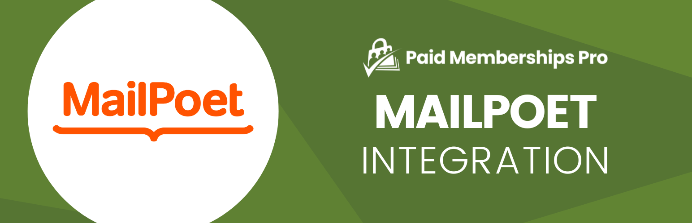

# [Paid Memberships Pro - MailPoet](https://www.paidmembershipspro.com/add-ons/mailpoet-integration/) #
[comment]: # (Generate badges from shields.io, only works for .org plugins to get other stats etc. We'd have to create our own endpoints for Premium plugins)

### Welcome to the Paid Memberships Pro - MailPoet GitHub Repository

This integration plugin is designed to support membership sites that use MailPoet to distribute email newsletters for their WordPress site.

With Paid Memberships Pro, you can automatically subscribe members to MailPoet lists or allow them to opt-in to specific MailPoet newsletters.

[MailPoet](https://wordpress.org/plugins/mailpoet/) is an email marketing plugin and service that you can use directly inside your WordPress site. You can use the MailPoet drag-and-drop builder to design custom email newsletters, select subscribers, and distribute emails through the WordPress admin.

For more information please visit [the Add On documentation page for this plugin](https://www.paidmembershipspro.com/add-ons/mailpoet-integration/).

## Installation ##
For detailed installation steps, visit the [documentation](https://www.paidmembershipspro.com/add-ons/mailpoet-integration/) page.

1. Download the current development ZIP file directly: `https://github.com/strangerstudios/MailPoet-Paid-Memberships-Pro-Add-on/archive/dev.zip`

**Please ensure that once installing this version of the plugin to remove `-dev` from the plugin's folder name.**

## Bugs ##
If you find an issue/bug, let us know by [creating a detailed GitHub issue](https://github.com/strangerstudios/MailPoet-Paid-Memberships-Pro-Add-on/issues/new/choose).

## Support ##
This is a developer's portal for Paid Memberships Pro - MailPoet. We do not offer support on this channel. **Any support related questions should be directed to [our website](https://www.paidmembershipspro.com/add-ons/mailpoet-integration/).**

## Contributing to Paid Memberships Pro - MailPoet ##
We encourage and welcome any contribution to Paid Memberships Pro - MailPoet. Please read the [guidelines for contributing](https://github.com/strangerstudios/MailPoet-Paid-Memberships-Pro-Add-on/blob/dev/.github/CONTRIBUTING.md) to this repository.

There are various **ways to the help development** of Paid Memberships Pro - MailPoet:

1. Report [bugs/issues](https://github.com/strangerstudios/MailPoet-Paid-Memberships-Pro-Add-on/issues/new/choose) on GitHub.
2. Work on any issues by submitting a Pull Request.

Here are some ways for **non-developers to contribute** to Paid Memberships Pro - MailPoet:

1. Translate Paid Memberships Pro - MailPoet into your own [language](https://www.paidmembershipspro.com/paid-memberships-pro-in-your-language/).
2. [Purchase a Plus membership](https://www.paidmembershipspro.com/pricing) to help fund ongoing development and bug fixes.